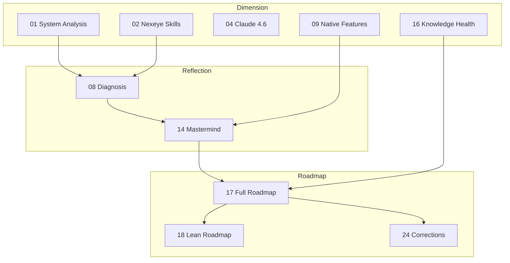

# 25 - Self-Documentation: Keeping the Spec Repo Alive

How to make a specification repo self-describing, staleness-resistant, and navigable — by humans and AI agents alike. Research synthesis, concrete mechanisms, and what to skip.

---

## The Problem

This repo is unusual: the documents ARE the system. There is no separate codebase that the docs describe — the specs are the primary artifact that the brana system will be built from. When a spec goes stale, the system gets built wrong. When cross-references break, decisions get lost.

Interconnected markdown files (numbered 00-39) maintained by one person with AI assistance. No documentation team. No wiki platform. No Confluence. Just git and markdown.

The question is not "how to write good docs" — it's how to build structural mechanisms that make staleness visible, cross-references checkable, and trust levels explicit.

---

## Core Principle: Documentation Quality = Agent Performance

This is not a metaphor. Anthropic's internal teams found that Claude Code performance improves proportionally to CLAUDE.md quality. Vercel's evals proved it empirically: CLAUDE.md achieves 100% pass rate vs 53% for skill invocation on always-needed knowledge.

For brana, this means the spec repo is operational infrastructure. A stale spec about hook events (doc 24 caught the Stop vs SessionEnd mismatch) doesn't just confuse a reader — it causes Claude to implement the wrong hook.

**The only reliable anti-rot mechanism is structural, not motivational.** "Everyone should keep docs updated" never works. What works: CI checks, dependency tracking, visible staleness indicators, and reviews tied to implementation milestones rather than calendar dates.

---

## Mechanism 1: YAML Frontmatter

Every document gets a machine-readable header. This is the single highest-leverage change — low effort, unlocks everything else.

### Schema

```yaml
---
id: 25
title: Self-Documentation
layer: dimension          # dimension | reflection | roadmap
status: accepted          # proposed | accepted | superseded | deprecated
growth_stage: budding     # seedling | budding | evergreen
last_reviewed: 2026-02-10
depends_on: []            # doc IDs this one builds on
depended_by: []           # doc IDs that build on this one
superseded_by: null       # doc ID if replaced
diataxis_type: explanation  # tutorial | how-to | reference | explanation
---
```

### Field Definitions

**layer** — Where this doc sits in the propagation hierarchy. Changes to a dimension doc should trigger review of reflection docs. Changes to a reflection doc should trigger review of roadmap docs. (See [MEMORY.md document layers](../README.md) for the full rules.)

**status** — Lifecycle state:
- `proposed`: draft, not yet validated. Don't build on this.
- `accepted`: reviewed, settled. Safe to depend on.
- `superseded`: replaced by another doc. `superseded_by` points to the replacement.
- `deprecated`: no longer relevant. Keep for historical context but don't follow.

**growth_stage** — Maturity indicator (from Maggie Appleton's digital garden pattern):
- `seedling`: early exploration, may be wrong. Treat as speculative.
- `budding`: shaped but evolving. Use with caution, expect revisions.
- `evergreen`: settled decision. Safe to depend on, rarely changes.

This is a trust signal for AI agents: a `growth_stage: seedling` tells Claude to treat content as speculative, while `evergreen` means firm decision.

**depends_on / depended_by** — Explicit dependency graph. Must be symmetric: if [doc 17](17-implementation-roadmap.md) depends on [doc 14](reflections/14-mastermind-architecture.md), then [doc 14](reflections/14-mastermind-architecture.md)'s `depended_by` must include 17. A validation script enforces this.

**diataxis_type** — Which of the four documentation types this doc primarily serves (Daniele Procida's Diataxis framework). Almost all current docs are `explanation`. This field exists to surface gaps — when implementation starts, the repo will need `how-to` and `reference` docs too.

### What Frontmatter Enables

| Frontmatter Field | What It Unlocks |
|---|---|
| `depends_on` / `depended_by` | Auto-generated dependency graph, PR impact analysis |
| `last_reviewed` | Staleness detection with per-layer thresholds |
| `status` | Filter out superseded/deprecated docs from active reading |
| `growth_stage` | AI agents know how much to trust each doc |
| `layer` | Automated upward propagation reminders |
| `diataxis_type` | Gap analysis — what doc types are missing? |

---

## Mechanism 2: Staleness Detection

### The Staleness Gradient

Not all documents rot at the same rate. The staleness gradient, from fastest to slowest:

1. **Specific model/API references** — model names, parameter defaults, API endpoints
2. **External tool versions** — ruflo features, Claude Code hook events
3. **Quantitative claims** — token costs, rate limits, benchmarks
4. **Cross-references between documents** — as docs evolve independently, refs drift
5. **Architecture decisions** — the most stable. "Use quarantine as first immune layer" won't go stale

### Layer-Aware Thresholds

Different document layers need different review cadences:

| Layer | Threshold | Why |
|---|---|---|
| Roadmap (17, 18, 19, 24) | 30 days | Implementation details change fast |
| Reflection (08, 14, 29, 31, 32) | 90 days | Architecture decisions are more stable |
| Dimension (01-07, 09-13, 15-16, 20-23, 25-28, 33-37) | 180 days | Research and analysis are the most durable |

**Implementation:** `scripts/staleness-report.sh` — checks git last-modified per doc against layer thresholds (Phase 1: age check) and flags docs whose dependencies updated more recently (Phase 2: dependency freshness). Two-tier output: WARN at 80% of threshold, STALE past threshold. Runs weekly via `brana-scheduler` with output stored in ruflo memory (`namespace: scheduler-runs`).

### Version-Pinned Package Tracking

The fastest-rotting content is external tool versions (#2 on the staleness gradient). Each dimension doc's **Refresh Targets** section includes a `**Versions:**` table that pins the version of every external package the doc references:

```markdown
**Versions:**
| Package | Pinned | Source |
|---------|--------|--------|
| ruflo | v3.1.0-alpha.44 | https://www.npmjs.com/package/claude-flow |
| agentdb | v3.0.0-alpha.3 | https://www.npmjs.com/package/agentdb |
| agentic-flow | v2.0.7 | https://www.npmjs.com/package/agentic-flow |
```

When `/brana:research --refresh` runs, agents compare pinned versions against the latest from each Source URL. Version deltas are the highest-priority output — a breaking change in ruflo is more urgent than a new blog post. After applying updates, the Versions table is updated to the new baseline. Packages pinned as "—" get their first version filled on the first refresh cycle.

### Dependency-Triggered Reviews

Age isn't the only trigger. If doc A depends on doc B, and B was updated more recently than A was last reviewed, flag A for review even if it hasn't hit its age threshold.

This catches the most dangerous failure mode: a dimension doc changes, but the reflection and roadmap docs that depend on it don't get updated. [Doc 24](24-roadmap-corrections.md) (roadmap corrections) exists because exactly this happened — specs referenced incorrect concepts that had changed upstream.

### Tie Reviews to Implementation Milestones

The only review cadence that actually works: review docs when you start implementing from them.

- Start Phase 1 → review [docs 04](dimensions/04-claude-4.6-capabilities.md)-07, 09, 11 (the dimension docs that inform it)
- Complete Phase 2 → update [docs 17](17-implementation-roadmap.md), 18 (the roadmap docs that describe it)
- Find an error during implementation → add to [doc 24](24-roadmap-corrections.md) (errata)

Calendar-based "quarterly review" cycles are too infrequent and disconnected from reality. By the time you review, the damage is done.

---

## Mechanism 3: CI/CD for Documentation

### Fast Checks on Every Push (~30 seconds)

| Check | Tool | What It Catches |
|---|---|---|
| Markdown structure | markdownlint-cli2 | Heading hierarchy, list style, formatting inconsistency |
| Internal links | lychee (local only) | Broken links when files are renamed or deleted |
| Cross-references | Custom script | "doc 99" references to nonexistent files |
| Terminology | Vale + custom style | "reasoning bank" instead of "ReasoningBank" |

### PR-Time Analysis

**Impact analysis**: "You changed `14-mastermind-architecture.md`. These docs depend on it: 17, 18. Please review them."

Built from the frontmatter `depends_on` / `depended_by` fields. A script parses changed files, walks the dependency graph, and comments on the PR.

### Scheduled Checks (Weekly)

| Check | What It Does |
|---|---|
| External link check | lychee (full) — catches dead URLs that break randomly |
| Staleness report | Flags docs past their layer threshold |
| Dependency freshness | Flags docs whose dependencies were updated more recently |
| Frontmatter validation | Checks symmetry of `depends_on`/`depended_by`, missing fields |

### Tool Configuration

**markdownlint** — spec-friendly config:
- Allow long lines (tables, URLs)
- Allow multiple H1s (each doc has its own title)
- Allow trailing punctuation in headings (questions in specs)
- Enforce consistent heading style (ATX) and list markers (dash)

**lychee** — link checker:
- Check local file links and fragment anchors
- Accept common redirect status codes (301, 302)
- Separate external URL checks to weekly schedule (too flaky for push)

**Vale** — prose linter with custom `brana` terminology:
```yaml
# Enforce consistent terms
swap:
  reasoning bank: ReasoningBank
  Reasoning Bank: ReasoningBank
  claude flow: ruflo
  Claude Flow: ruflo
  sona: SONA
  session end: SessionEnd
  session start: SessionStart
```

---

## Mechanism 4: Auto-Generated Indexes

### The Problem with Manual Indexes

README.md and MEMORY.md are manually maintained indexes of the spec documents. Every time a doc is added, renamed, or changes status, both indexes must be updated by hand. This is itself a staleness vector — the index drifts from reality.

### What to Generate

**README.md document table** — generated from frontmatter. Each row shows: filename, title, layer badge, growth stage, status. Replaces the current manual table.

**Mermaid dependency graph** — generated from `depends_on` fields. Embedded in README.md between markers so it auto-updates:



**MEMORY.md document map** — the document list section can be generated from frontmatter rather than maintained by hand. Other sections (key findings, architecture summaries) remain manual since they capture compressed insight, not just metadata.

### Generation Pattern

Scripts read all `*.md` files, parse YAML frontmatter, and write output between `<!-- START -->` / `<!-- END -->` comment markers. This is the Simon Willison pattern: metadata lives in the files, rendered views are generated by scripts. The script is idempotent — run it any time, get the current state.

---

## Mechanism 5: Cross-Reference Hygiene

### The Current State

The repo has two kinds of cross-references:

1. **Formal markdown links**: `[16-knowledge-health.md](dimensions/16-knowledge-health.md)` — machine-checkable
2. **Informal prose references**: "[doc 16](dimensions/16-knowledge-health.md)", "per [doc 12](dimensions/12-skill-selector.md) quarantine rules" — human-readable but invisible to link checkers

About half the references are informal. These are the most fragile: if a document is renamed or its sections reorganize, the prose reference silently breaks.

### The Fix

**Convert informal references to formal links.** Every "see [doc 16](dimensions/16-knowledge-health.md)" should become `[doc 16](dimensions/16-knowledge-health.md)`. This is a one-time cleanup that makes the entire collection machine-checkable via lychee.

**Add a cross-reference validation script** that:
1. Extracts all `doc NN` prose references (regex: `doc\s+\d+`)
2. Verifies the file `NN-*.md` exists
3. Reports orphan documents (docs not referenced by any other doc)
4. Reports broken prose references

**Add explicit cross-reference sections** to each document. Following Andy Matuschak's "dense linking" principle — every doc should declare what it relates to:

```markdown
## Cross-References

- [08-diagnosis.md](./08-diagnosis.md) — keep/drop/defer decisions this doc supports
- [17-implementation-roadmap.md](./17-implementation-roadmap.md) — Phase 2 testing methodology
- [16-knowledge-health.md](./16-knowledge-health.md) — staleness detection for patterns maps to staleness detection for docs
```

---

## Mechanism 6: Growth Stages as Trust Signals

### Why This Matters for AI Agents

When Claude reads the spec documents to build the brana system, it needs to know which documents to trust fully and which to treat as exploratory. Without explicit maturity markers, Claude treats all documents equally — even early-stage research that may have been superseded.

### Stage Definitions

**Seedling** — Early exploration. May be incomplete, speculative, or wrong.
- The doc captures initial research or a preliminary idea
- Don't build on it without verifying against other sources
- Expected to change significantly
- *Current example: none (all docs have passed this stage)*

**Budding** — Shaped but still evolving. Has substance but hasn't been battle-tested.
- The doc has been through discussion and revision
- Core ideas are sound but details may shift during implementation
- Safe to reference, but check before depending on specifics
- *Current examples: [docs 17](17-implementation-roadmap.md), 18, 19 (roadmaps and PM design — will evolve during implementation)*

**Evergreen** — Settled decision. Rarely changes. Safe to depend on.
- The doc has been validated through implementation experience or through cross-referencing multiple research sources
- Core findings are stable. Only details (version numbers, tool names) may need updating
- *Current examples: [docs 01](dimensions/01-brana-system-analysis.md)-03 (current system analysis — facts about what exists), [doc 08](reflections/08-diagnosis.md) (diagnosis — decisions are made)*

### Promotion Criteria

- **Seedling → Budding**: doc has been reviewed, cross-referenced with other docs, and the core ideas survive
- **Budding → Evergreen**: doc has been validated through implementation or its claims are confirmed by multiple independent sources

Demotion also happens: an `evergreen` doc can regress to `budding` if implementation reveals its assumptions were wrong. This is the spaced-repetition insight from Andy Matuschak — documents you actively reference during implementation stay fresh; documents you don't touch silently rot.

### Swyx's Learning Gears as a Lens

The growth stages map to Swyx's Learning Gears framework:
- **Explorer gear** (seedling) — covering ground fast, raw notes, high speed, many directions
- **Connector gear** (budding) — linking ideas, building frameworks, structured analysis
- **Mining gear** (evergreen) — deep architectural work, settled conclusions

This repo's natural evolution: [docs 01](dimensions/01-brana-system-analysis.md)-03 were Explorer output, [docs 04](dimensions/04-claude-4.6-capabilities.md)-13 were Connector output, [docs 14](reflections/14-mastermind-architecture.md)-19 are Mining output.

---

## Mechanism 7: Documentation Locality — Don't Split Docs Across the Repo

### The Sprawl Problem

A spec repo with dozens of documents has a natural tendency to grow satellite files: README.md indexes, MEMORY.md summaries, CLAUDE.md instructions, frontmatter schemas, validation scripts, generated graphs. Each new meta-artifact creates a maintenance surface that duplicates information from the source docs.

The brana ecosystem already has five places where doc-like content lives:
1. **This repo** (`enter/`) — the spec documents (source of truth)
2. **MEMORY.md** (`~/.claude/projects/*/memory/`) — compressed summaries for agent recall
3. **README.md** — human-readable index and dependency graph
4. **CLAUDE.md** (project-level) — instructions for agents working in this repo
5. **thebrana/** — the implementation repo, which starts accumulating its own docs

Every time a spec changes, the question is: how many of these other locations need updating? If the answer is "more than one," the system has a locality problem.

### The Rule: One Fact, One Location, Zero Manual Copies

Martraire's *Living Documentation* principle: **knowledge should live on the thing it describes.** For a spec repo this means:

- **Spec content lives in the numbered doc files.** Period. No substantive claims in README.md, no architectural decisions in MEMORY.md, no design rationale in CLAUDE.md.
- **README.md is a generated view.** It should contain only: a brief purpose statement, a generated doc table, a generated dependency graph, and a generated decision index. All generated from frontmatter. If README.md requires manual editing beyond the purpose statement, something is wrong.
- **MEMORY.md is a lossy cache.** It compresses spec content for agent context windows. It's allowed to be stale — agents should follow links to source docs for decisions. Never add information to MEMORY.md that doesn't exist in a source doc.
- **CLAUDE.md is behavioral instructions.** It tells agents HOW to work with the repo, not WHAT the specs say. "When adding new docs, update README.md" is correct. "The system uses three trust tiers" is not — that belongs in [doc 12](dimensions/12-skill-selector.md).

### Specific Anti-Patterns

**The Summary Creep.** MEMORY.md starts as a brief index, then grows paragraphs of architectural summaries. Now there are two places describing the mastermind architecture: [docs 14](reflections/14-mastermind-architecture.md)/31/32 and MEMORY.md. When a reflection doc changes, MEMORY.md drifts silently.

*Fix:* MEMORY.md summaries should be one-liners with links. Deep content stays in source docs. Treat MEMORY.md like a database index — it helps you find things, it doesn't replace them.

**The Shadow Spec.** A PR adds a `docs/` directory or `ADR/` folder inside the implementation repo. Now specs live in two places. Which one is authoritative?

*Fix:* One repo for specs, one for code. The code repo's `.claude/CLAUDE.md` references the spec repo. It never duplicates spec content. If a spec needs to be close to the code it describes, that's a signal the spec should graduate into the code repo's own docs — but then it leaves the spec repo (move, don't copy).

**The Meta-Doc Spiral.** A doc about how to write docs (this one). A doc about how to review docs. A doc about the doc validation pipeline. A doc about the doc generation scripts. Each meta-doc adds maintenance burden without adding spec content.

*Fix:* Cap meta-docs at one (this document). Validation and generation details belong in script comments or a short section in CLAUDE.md, not in dedicated spec documents. This doc is already at the limit — resist creating [doc 26](dimensions/26-git-branching-strategies.md) about "documentation workflow."

**The Cross-Repo Reference.** Spec docs reference thebrana/ implementation details. Implementation docs reference spec doc numbers. Now changes in either repo can silently break the other.

*Fix:* Specs reference concepts, not file paths. "The session-start hook should recall patterns" not "see `thebrana/system/hooks/session-start.sh` line 30." Implementation references to specs should use stable doc IDs (`per spec 14`) not file paths that could rename.

### Locality Checklist

When adding any new file to the repo, ask:

1. **Does this fact already live somewhere?** If yes, link to it instead of restating it.
2. **Is this generated or manual?** If it can be generated from frontmatter, it should be. Manual indexes rot.
3. **Will two places need updating when this changes?** If yes, you've created a duplication. Eliminate one copy.
4. **Does this belong in this repo?** Implementation details belong in the implementation repo. Process docs belong in CLAUDE.md. Only research, analysis, and architectural decisions belong here.

### Research Sources for Locality

- Martraire, *Living Documentation*: "the ideal number of places where a piece of knowledge is recorded is exactly one"
- DRY applied to documentation: Kent Beck and Ward Cunningham's original insight was about knowledge duplication, not just code duplication
- Google's documentation model: docs live next to the code they describe, in the same repository, reviewed in the same PRs
- Diátaxis: each doc type has one home — don't scatter tutorials across README, wiki, and blog posts
- The Wikipedia model: articles are self-contained; disambiguation pages link but don't duplicate

---

## What NOT to Do

Research surfaced many approaches that are wrong for this specific repo. Capturing them explicitly so they don't get re-evaluated later.

| Temptation | Why Skip | Source |
|---|---|---|
| Reorganize into atomic Zettelkasten notes | 30 thematic docs is the right granularity for specs. Zettelkasten IDs add noise. | Matuschak's own notes show the pattern is for personal thinking, not team/AI docs |
| Adopt Obsidian/wiki tooling | Git-native is the right home. Tools that need their own editor fragment the workflow. | The repo is already markdown + git. Adding a tool adds a dependency. |
| Full literate programming (tangle/weave) | No code to tangle. The specs describe a system that doesn't exist as code yet. | Revisit when thebrana/ has real code and specs can generate configs from prose. |
| SemVer per document | Too much maintenance for a collection this interconnected. Docs move together, not independently. | Use git tags for collection milestones instead (`specs-v1.0`). |
| Quarterly review cycles | Too infrequent. By the time you review, the spec is already harmful. | Tie reviews to implementation milestones, not calendar dates. |
| AI-generated documentation | Creates docs that read well but may contain hallucinations. | Use AI to check docs (consistency linting), not to write them. |
| Full Diataxis reorganization | This repo is 90% Explanation type. That's correct for a spec repo. | Use Diataxis as a diagnostic lens, not a reorganization mandate. |
| Duplicate information in multiple places | MEMORY.md, README.md, and doc content should not repeat the same facts manually. | Generate indexes from frontmatter to maintain single source of truth. |
| Scatter docs across directories/repos | `docs/`, `ADR/`, `specs/` subdirectories fragment the collection and make staleness invisible. | Flat directory, numbered files, one repo. See Mechanism 7. |
| Create meta-docs beyond this one | Docs about doc workflow, doc tooling, doc review process. Each adds maintenance without spec content. | One meta-doc (this). Process details in CLAUDE.md or script comments. |

---

## Decision Index Pattern

### The Gap

Decisions are scattered across 30 documents. When a future reader asks "why did we choose quarantine over deletion for bad patterns?" they must search through [doc 16](dimensions/16-knowledge-health.md) to find the reasoning. There's no central list of decisions.

### The Solution

A decision index that extracts key decisions from all docs into a navigable list. Not a separate document — a generated section in README.md:

```markdown
## Key Decisions

| Decision | Made In | Status |
|---|---|---|
| Drop custom skill routing — Claude 4.6 reasons about skills directly | [doc 08](./08-diagnosis.md) | accepted |
| ReasoningBank is the #1 value-add over native capabilities | [doc 08](./08-diagnosis.md) | accepted |
| Three trust tiers for skills: local, catalog, discovery | [doc 12](./12-skill-selector.md) | accepted |
| Quarantine over deletion for bad patterns | [doc 16](./16-knowledge-health.md) | accepted |
| Three critical hooks: SessionStart, SessionEnd, PostToolUse | [doc 14](./14-mastermind-architecture.md) | accepted (corrected in doc 24) |
| Start with lean roadmap, use full roadmap as reference | [doc 18](./18-lean-roadmap.md) | proposed |
```

This is the ADR (Architecture Decision Record) pattern applied without restructuring. Existing documents stay as they are. The index just makes decisions findable.

### Extraction Method

Each document should mark its key decisions with a consistent pattern (a heading like `## Key Decisions` or `## Decisions`). The generation script extracts these sections and compiles the index. Until that's automated, the index can be maintained manually as a section in README.md.

---

## Implementation Priority

### Phase 1: Immediate (do before Phase 1 of implementation)

1. **Add YAML frontmatter** to all 30 documents — `id`, `title`, `layer`, `status`, `growth_stage`, `last_reviewed`, `depends_on`, `depended_by`
2. **Convert informal cross-references** — replace "doc NN" prose with `[doc NN](./NN-filename.md)` links
3. **Add lychee to CI** — single GitHub Action, catches broken links on push, zero maintenance
4. **Write frontmatter validation script** — check symmetric dependencies, missing fields

### Phase 2: During implementation

5. **Add markdownlint** with spec-friendly config
6. **Add Vale** with custom `brana` terminology style
7. **Write impact analysis script** — on PR, report dependent docs that need review
8. **Auto-generate Mermaid dependency graph** in README.md
9. ~~**Add staleness check** with per-layer thresholds~~ — **implemented** as `scripts/staleness-report.sh` (2026-02-19). Scheduled weekly via `brana-scheduler`.

### Phase 3: When the collection stabilizes

10. **Auto-generate README.md document table** from frontmatter
11. **Create decision index** — initially manual, then auto-extracted from doc sections
12. **Build LLM consistency checker** — a Claude Code skill that compares key claims across related docs for contradictions

---

## All Commands

The brana system has 25+ skills (invoked as `/brana:*`), 4 agent commands, and 11 specialized agents (scout, memory-curator, client-scanner, venture-scanner, challenger, debrief-analyst, archiver, daily-ops, metrics-collector, pipeline-tracker, pr-reviewer). Skills and agents integrate via five patterns documented in [14-mastermind-architecture.md](reflections/14-mastermind-architecture.md).

### Spec Maintenance

Commands for keeping the spec repo healthy. These operate on documents.

| Command | Purpose | When to use |
|---|---|---|
| **`/brana:maintain-specs`** | Full correction cycle: apply errata → re-evaluate reflections → deepen → check [doc 25](25-self-documentation.md) → update memory → surface findings | **After `/brana:close`, or when you suspect doc drift** |
| `/brana:research --refresh` | Web search for external updates to dimension docs (batch mode, parallel scouts by topic group) | Before `/brana:maintain-specs` when external tools may have changed |
| `/brana:research` | Atomic research primitive: topic, doc, creator, or leads — recursive discovery with source registry | **Ad-hoc research**. See [33-research-methodology.md](dimensions/33-research-methodology.md) |
| `/brana:re-evaluate-reflections` | Cross-check dimension vs reflection docs | When you only want to check, not fix |
| `/brana:apply-errata` | Apply pending fixes from [doc 24](24-roadmap-corrections.md), layer by layer | When you already have errata and just want to apply them |
| `/brana:reconcile` | Detect drift between specs and thebrana implementation, plan fixes, apply after approval | **After `/brana:maintain-specs`** when impl-relevant specs changed, or periodically to check for accumulated drift |
| `/brana:repo-cleanup` | Commit accumulated spec doc changes with proper branching | When modified files have built up across sessions |

### Knowledge Management

Commands for the learning loop. These operate on the pattern memory (ruflo DB).

| Command | Purpose | When to use |
|---|---|---|
| `/brana:memory recall` | Search learned patterns, grouped by confidence tier (proven/quarantined/suspect) | **Start of work** — "what do I already know about this?" |
| `/brana:retrospective` | Store a learning + review recalled patterns (promote useful, demote harmful) | **End of work** — "what did I learn this session?" |
| `/brana:memory pollinate` | Pull transferable patterns from other clients | **When stuck** — "did another project solve this?" |
| `/brana:onboard` | Scan and diagnose a project (code, venture, or hybrid) — structure, stage, gaps, patterns | **First session on a new project** — auto-detects project type |
| `/brana:align` | Active alignment pipeline: assess gaps → plan → implement structure → verify → document | **After `/brana:onboard`** identifies gaps, or when setting up a new project |
| `/brana:client-retire` | Archive a project's patterns, keep transferable ones active | **Once per project** — when a project is done |
| `/brana:memory review` | Monthly ReasoningBank health check: stats, staleness, promotion candidates | **Monthly** or when curious about knowledge health |
| `/brana:close` | Session end: debrief-analyst → store learnings as quarantined patterns → doc drift heuristic → handoff note → ruflo store | **Session end** — auto-detects what happened from git activity |

### Implementation & Quality

Commands for building and reviewing.

| Command | Purpose | When to use |
|---|---|---|
| `/brana:build` | Unified dev command — auto-detects strategy (feature, bug fix, refactor, spike, migration, investigation, greenfield). Build loop: specify → plan → build → close | **When building anything** — integrates with `/brana:backlog start` |
| `/brana:close` | Extract errata, learnings, patterns from a session. Write handoff note, detect doc drift | **End of session** — or when switching projects |
| `/brana:challenge` | Spawn an Opus subagent to stress-test a plan or decision. Empty invocation self-challenges the last answer | **Before committing to a big decision**, or after any answer to stress-test it |
| `/brana:backlog` | Plan, track, and execute tasks — hierarchy (phase > milestone > task), streams, tags, context, branch integration, agent execution via subagents | **When planning phases, viewing roadmaps, or executing task waves** — 16 subcommands including `plan`, `status`, `start`, `execute`, `tags`, `context`, `theme`, `triage`, `sync` |
| `/brana:scheduler` | Manage systemd-timer scheduled jobs — status, enable/disable, logs, manual runs | **When managing scheduled background jobs** |
| `/brana:respondio-prompts` | Respond.io AI agent prompt engineering — write instructions, actions, KB files, multi-agent architectures within platform constraints | **When writing or reviewing Respond.io agent prompts** |
| `/brana:export-pdf` | Convert markdown to PDF using mdpdf — consistent A4 format, clean styling | **When exporting proposals, docs, or reports to PDF** |
| `/brana:log` | Capture events (links, calls, meetings, ideas) into append-only log. Bulk mode for WhatsApp dumps | **When something happened** — quick capture |
| `/brana:plugin` | Manage Claude Code plugins — add marketplaces, install, update, remove, list | **When managing plugin installations** |
| `/brana:acquire-skills` | Find and install skills for project tech gaps | **For new or unfamiliar tech** |
| `/brana:harvest` | Extract post ideas from recent work through positioning lens — content pipeline | **When looking for content ideas from recent sessions** |

### Business & Venture Management

Commands for non-code project management. These operate on business project structure and knowledge. See [28-startup-smb-management.md](dimensions/28-startup-smb-management.md) for the research and [29-venture-management-reflection.md](reflections/29-venture-management-reflection.md) for the architecture rationale.

| Command | Purpose | When to use |
|---|---|---|
| `/brana:onboard` | Diagnostic: scan and diagnose a project (auto-detects code/venture/hybrid). For ventures: stage classification, framework recommendation, gap report | **First session on a business project** |
| `/brana:align` | Active setup: stage-appropriate templates, SOPs, OKRs, metrics, meeting cadences | **After `/brana:onboard`** identifies gaps |
| `/brana:venture-phase` | Plan and execute a business milestone (launch, hiring, fundraise, expansion, process overhaul) | **When executing a specific business milestone** |
| `/brana:review` | Business health — weekly (default), monthly, or ad-hoc check. Replaces separate /morning, /weekly-review, /monthly-close, /monthly-plan | **Daily/weekly/monthly** — `/brana:review check` (daily), `/brana:review` (weekly), `/brana:review monthly` |
| `/brana:pipeline` | Sales pipeline tracking: leads, deals, conversions, follow-ups | **Ongoing** — when managing sales activity |
| `/brana:financial-model` | Revenue projections, scenario analysis, P&L template, unit economics | **When building or updating financial projections** |
| `/brana:proposal` | Generate a client proposal — interview-driven, structured markdown with cost breakdown | **When preparing a service proposal** |
| `/brana:meta-template` | Write Meta WhatsApp templates optimized for Utility classification | **When creating WhatsApp Business templates** |
| `/brana:notebooklm-source` | Prepare and format sources for NotebookLM upload | **When feeding research into NotebookLM** |
| `/brana:gsheets` | Google Sheets operations via MCP: read, write, create, list, share | **When working with spreadsheet data** |

### When to Use What — The Workflow Map

Commands fit into natural moments in your work. You don't need all of them every session — use what the moment calls for.

**Starting a new code project:**
```
/brana:onboard
```

Example: You clone a new Next.js + Supabase project. `/brana:onboard` scans `package.json`, detects the stack, and recalls patterns from other clients that used the same tech:

```
Tech stack detected: Next.js 14, Supabase, TypeScript, Tailwind
Relevant patterns found:
  - [nexeye] Supabase auth: use server-side client in middleware, not client-side
    (confidence: 0.8, transferable, from 4 recalls)
  - [nexeye] Next.js: put shared types in /types, not /lib/types
    (confidence: 0.5, quarantined)
Suggested: creating .claude/CLAUDE.md with these conventions...
```

---

**Starting a session (any project):**
```
/brana:memory recall [topic]
```
Optional. Most useful when starting a new task or returning to a topic after a gap. The session-start hook already auto-recalls project patterns, but `/brana:memory recall` lets you search for specific topics.

Example — about to work on hook testing:
```
/brana:memory recall hook testing
```
```
## Proven patterns (confidence >= 0.7)
- [brana] Hook testing requires full pipeline simulation — bash -n
  catches syntax but not logic. Pipe real JSON, verify side effects.
  (confidence: 0.8, recalls: 4, source: brana)

## Quarantined patterns (confidence < 0.7)
- [brana] memory search preview truncates stored JSON — use memory
  retrieve for field-level verification.
  (confidence: 0.5, recalls: 1, source: brana)

## Suspect patterns (confidence < 0.2)
  (none)
```

Example — broad recall before starting work:
```
/brana:memory recall supabase auth
```

---

**Aligning a project with brana practices:**
```
/brana:align
```
The active complement to `/brana:onboard`. Runs a 28-item checklist, identifies gaps, and creates the missing structure: CLAUDE.md, rules, docs/decisions/, test framework, domain glossary. Works in tiers (Minimal/Standard/Full) — the user picks.

---

**Planning and building:**
```
/brana:build [description]   (any feature, bug fix, refactor, spike, etc.)
/brana:challenge [plan]      (adversarial review — or empty to self-challenge last answer)
```
`/brana:build` is the unified dev command. It auto-detects strategy (feature, bug fix, refactor, spike, migration, investigation, greenfield) and guides work through 4 phases: specify → plan → build → close. Spawns scout, memory-curator, challenger, and debrief-analyst agents at appropriate stages. Creates feature briefs in `docs/features/`, ADRs when `docs/decisions/` exists. `/brana:challenge` is surgical — provide a plan to stress-test, or invoke empty to self-challenge the last answer.

Example — stress-testing a migration plan:
```
/brana:challenge We're planning to move from REST to tRPC across 40 endpoints.
  The plan is to migrate one router at a time over 3 sprints.
```
Spawns an Opus subagent that might respond:
```
Pre-mortem: This migration failed 3 months in. What went wrong?

1. Sprint 2 stalled because shared middleware (auth, rate limiting)
   assumed REST request shape. tRPC procedures don't carry headers
   the same way. You'd need to migrate middleware FIRST, not per-router.

2. The 40 endpoints have 12 consumer apps. Without a compatibility
   layer, migrating one router breaks consumers that mix old/new calls.

Suggestion: Migrate middleware → add dual-mode adapter → then routers.
```

---

**After notable work (something learned, something broke):**
```
/brana:retrospective [learning]
```
This is the **most important knowledge command**. Every learning you store starts at `confidence: 0.5` (quarantined). As you recall and validate it across sessions, `/brana:retrospective` promotes it. Without this, the knowledge system accumulates data but never builds trust.

Example — you just discovered that `npx` is unreliable in hook subprocesses:
```
/brana:retrospective npx downloads packages on every call when run from $HOME
  because there's no local node_modules. Use direct binary path instead.
```
```
Stored pattern:
  key: pattern:brana:npx-unreliable-in-hooks
  confidence: 0.5 (quarantined)
  transferable: false
  tags: client:brana, tech:nodejs, type:hooks, outcome:failure

Reviewing recalled patterns from this session...
  - "Hook testing requires full pipeline simulation" was recalled
    and was useful this session. recall_count: 3 → 4.
    Promoting to confidence: 0.8, transferable: true ✓
  - No harmful patterns to demote.
```

Example — just a quick learning, no argument:
```
/brana:retrospective
> What did you learn?
Supabase RLS policies silently return empty rows instead of 403 errors.
  Always check .error AND .data.length to detect permission failures.
```

---

**End of implementation sessions:**
```
/brana:close
```
`/brana:close` extracts what went wrong (errata) and what you learned (lessons), writes a handoff note for the next session, stores patterns, and detects doc drift. Then `/brana:maintain-specs` propagates findings into the spec docs.

Example — after a Phase 2 implementation session:
```
/brana:close
```
```
## Session Close
Commits this session: 8
Learnings extracted: 3 (2 errata, 1 learning, 0 issues)
Patterns stored: 2
Doc drift detected: yes
Handoff note updated: ~/.claude/projects/.../memory/session-handoff.md

### Follow-up
- /brana:maintain-specs to propagate findings
- Specs may need updating for changed system files
```

---

**When stuck on a problem:**
```
/brana:memory pollinate [topic]
```
Searches for transferable patterns across all clients. Only shows patterns with `transferable: true` or high confidence.

Example — struggling with test reliability in a new project:
```
/brana:memory pollinate flaky tests
```
```
Found 2 transferable patterns from other clients:

[brana] ((var++)) under set -e exits when var is 0
  Bash arithmetic post-increment returns the old value. Under set -e,
  a 0 result means exit code 1 → script dies silently.
  Fix: use VAR=$((VAR + 1)) instead.
  (confidence: 0.8, source: brana, validated 3x)

[nexeye] Supabase test isolation: each test needs its own anon key
  Shared auth state between tests causes order-dependent failures.
  Fix: create fresh Supabase client per test suite.
  (confidence: 0.7, source: nexeye, validated 3x)

Note: cross-pollinated patterns should be validated in your project
context before trusting them.
```

---

**Retiring a client:**
```
/brana:client-retire [project-name]
```

Example:
```
/brana:client-retire nexeye
```
```
Found 12 patterns for nexeye:
  - 3 high-confidence + transferable → keeping active
    (Supabase auth middleware, RLS empty-row gotcha, test isolation)
  - 5 high-confidence + project-specific → archived
  - 4 low-confidence → archived
Updated portfolio.md: nexeye marked as retired.
```

---

**Starting a new business project:**
```
/brana:onboard
```
Auto-detects project type (code/venture/hybrid). For ventures: classifies the business stage (Discovery/Validation/Growth/Scale), recommends frameworks (Lean Startup, EOS, OKRs, Scaling Up), and identifies gaps.

Example:
```
/brana:onboard
```
```
## Venture Onboard: Acme SaaS

Stage: Validation
Domain: SaaS (B2B)
Team size: 4

Recommended Framework: Lean Startup + light OKRs (1-2 objectives max)

Gaps (prioritized):
Critical:
  - No decision log (docs/decisions/)
  - No metrics tracking
Important:
  - No CLAUDE.md with business context
  - No experiment tracking

Suggested: Run /brana:align to implement the recommended structure
```

---

**Setting up business management structure:**
```
/brana:align
```
The active complement to `/brana:onboard`. Creates stage-appropriate templates: CLAUDE.md with business context, decision log, metrics framework, meeting cadence, OKR templates, SOP directory. Runs a stage-aware checklist and shows before/after scores.

---

**Executing a business milestone:**
```
/brana:venture-phase [type]
```
Plans and executes a business milestone with learning loops. Five built-in milestone types: product launch, hiring round, fundraise, market expansion, process overhaul. Each generates stage-appropriate work items with exit criteria.

Example:
```
/brana:venture-phase hiring
```
```
## Milestone: Hiring Round

Work Items:
| # | Item | Exit Criteria |
| 1 | Role definition | Job spec in docs/ |
| 2 | Job description | JD created |
| 3 | Sourcing strategy | Strategy documented |
| 4 | Interview process | SOP documented |
| 5 | Onboarding SOP | SOP documented |

Approve this plan? [y/n]
```

---

**Checking business health:**
```
/brana:review check        (daily focus card)
/brana:review              (weekly health check — default)
/brana:review monthly      (monthly close + forward plan)
```
`/brana:review` consolidates daily, weekly, and monthly business health into one command. Detects business model type and selects appropriate metrics. Weekly mode audits stage-appropriate metrics, runs AARRR funnel analysis, checks founder leverage, and compares against previous snapshots.

Example:
```
/brana:review
```
```
## Growth Check: Acme SaaS

Stage: Growth

| Metric | Value | Benchmark | Status |
| MRR | $45K | Growing | 🟢 |
| LTV:CAC | 2.1:1 | 3:1+ | 🟡 |
| Monthly churn | 8% | <5% | 🔴 |

AARRR Bottleneck: Retention — churn is the constraint.
  Fix retention before investing more in acquisition.

Trend vs last check: MRR ↑12%, churn → (flat), LTV:CAC ↓
```

---

**Continuing a previous session:**

The SessionStart hook auto-recalls patterns, tasks, and correction patterns from the previous session. No separate command needed — context is injected automatically when Claude Code starts.

### The Confidence Lifecycle

This is the core loop that `/brana:retrospective` and `/brana:memory recall` drive:

```
New learning ──→ confidence: 0.5 (quarantined)
                      │
              recalled + useful (3x)
                      │
                      ▼
              confidence: 0.8 (proven, transferable)
                      │
              /brana:memory pollinate can share it
                      │
                      ▼
              other clients benefit

    recalled + harmful ──→ confidence: 0.1 (suspect)
```

Hooks handle the plumbing (auto-recall at session start, auto-store at session end). Skills handle the judgment (was this useful? should it be promoted?). **The hooks can't promote — only `/brana:retrospective` can**, because promotion requires your judgment about whether a pattern was actually useful.

### Command Architecture

Two orchestrators (code and business), shared learning loop. No circular follow-ups.

```
CODE PROJECTS                              BUSINESS PROJECTS
══════════════                             ═════════════════

/brana:build [desc]                        /brana:venture-phase [type]
  │                                          │
  ├── SPECIFY → define scope + ADR           ├── Orient → Plan
  │   → Recall patterns                      │   → Recall
  ├── PLAN → implementation plan             ├── Execute loop ─┐
  ├── BUILD loop ─┐                          │   │  create docs
  │   │  implement                           │   │  → verify
  │   │  → verify                            │   │  → mini-debrief
  │   │  → commit                            │   │  → store learning
  │   │  → mini-debrief                      │   └──────────────┐
  │   └──────────┐                           ├── Validate exit criteria
  ├── CLOSE → PR, debrief, update task       └── Report + debrief
  └── /brana:close at session end

/brana:onboard → /brana:align              /brana:onboard → /brana:align
  (auto-detects code)                        (auto-detects venture)

                                           /brana:review (daily/weekly/monthly)

SHARED LEARNING LOOP
════════════════════

/brana:close (after any session — code or business)
  │
  └──→ "Run /brana:maintain-specs to propagate findings"  (forward)

/brana:research --refresh (optional, run separately)
  │
  └──→ "Run /brana:maintain-specs to propagate changes"

FORWARD PROPAGATION (specs → specs)
────────────────────────────────────
/brana:maintain-specs
  │
  ├── Step 1: Apply errata, layer by layer
  │            (= what /brana:apply-errata does standalone)
  │            Corrects known issues first so reflections start clean.
  │   ├── Dimension fixes
  │   ├── Gate check → reflection cascade?
  │   ├── Reflection fixes
  │   ├── Gate check → roadmap cascade?
  │   ├── Roadmap fixes
  │   └── Update doc 24 (mark applied, add cascades)
  │
  ├── Step 2: Re-evaluate reflections against dimension docs
  │            (= what /brana:re-evaluate-reflections does standalone)
  │            → no gaps? skip to step 3
  │            → gaps found? append to doc 24
  │
  ├── Step 3: Deepen reflections — sharpen synthesis
  │
  ├── Step 4: Check doc 25 — is the user guide still current?
  │
  ├── Step 5: Memory hygiene — update MEMORY.md files
  │            (skill command table, stale facts, error counts)
  │
  ├── Step 6: Backlog review — check doc 30 pending items
  │
  ├── Step 7: Surface findings — ask user about storing
  │            notable discoveries via /brana:retrospective
  │
  └── Step 8: Backup knowledge — run brana-knowledge backup
               if knowledge artifacts were modified

FORWARD PROPAGATION (specs → implementation)
─────────────────────────────────────────────
/brana:reconcile
  │
  ├── Step 0: Orient — locate repos, check clean state, create branch
  │
  ├── Step 1: Scan specs — extract concrete claims about thebrana
  │            from dimension, reflection, roadmap docs + CLAUDE.md
  │
  ├── Step 2: Scan implementation — extract current state from
  │            skills, hooks, rules, agents, config, deploy
  │
  ├── Step 3: Diff — classify drift (missing/stale/incomplete/extra)
  │            Apply materiality filter (same as /brana:maintain-specs)
  │
  ├── Step 4: Present drift report — grouped by area, with proposed fixes
  │            → user approves before any changes
  │
  ├── Step 5: Apply auto-fixable changes (text, config, metadata)
  │            → new capabilities deferred to /brana:build
  │
  ├── Step 6: Log to doc 24 — reconcile run entry with findings table
  │
  ├── Step 7: Store in ReasoningBank — run metadata for future recall
  │
  └── Step 8: Report — no auto-merge or auto-deploy

Trigger: /brana:maintain-specs suggests /brana:reconcile when impl-relevant specs change.
The two commands form a pair: /brana:maintain-specs cascades within specs,
/brana:reconcile pushes spec changes into implementation.

BACK PROPAGATION (implementation → specs)
─────────────────────────────────────────
Implementation changes update docs in the same commit (no separate
back-propagation step). The /brana:close session-end skill detects
doc drift and suggests /brana:maintain-specs when system files changed.

INTEGRATION POINTS
──────────────────
Commands that should suggest /brana:reconcile:

  /brana:maintain-specs → when cascaded changes touch impl-relevant specs
                    (skills, hooks, rules, agents, config, deploy)

Commands that should suggest /brana:maintain-specs:

  /brana:close    → when findings include spec-level errata
  /brana:research --refresh → after discovering external changes

CROSS-POLLINATION (the differentiator)
══════════════════════════════════════
Code and business patterns live in the same ReasoningBank.
/brana:memory pollinate surfaces insights across both domains.
/brana:retrospective stores learnings from any session type.
```

**Why `/brana:research --refresh` is separate:** It runs web searches across all dimension docs — expensive and slow. The rest of the cycle works purely from local docs and is fast. Run `/brana:research --refresh` when you suspect external tools or platforms have changed, then `/brana:maintain-specs` to propagate.

### Recommended Workflow

**Regular maintenance:**
```
/brana:maintain-specs
```
That's it. Re-evaluates, applies fixes, checks [doc 25](25-self-documentation.md), updates memory, asks about storing findings. Exits early at every step if nothing needs doing.

**After a long gap or major external changes:**
```
/brana:research --refresh  ← check external world first
[update stale dimension docs manually]
/brana:maintain-specs        ← propagate through all layers
```

---

## Toolchain Summary

| Tool | Purpose | When |
|---|---|---|
| **lychee** | Link checking (local + external) | CI push + weekly schedule |
| **markdownlint-cli2** | Markdown structural linting | CI push |
| **Vale** | Prose/terminology consistency | CI push |
| **Custom: check-cross-refs.py** | Validate `doc NN` references | CI push |
| **Custom: validate-frontmatter.py** | Symmetric deps, required fields | CI push |
| **Custom: impact-analysis.py** | PR dependency impact report | CI pull_request |
| **Custom: staleness-report.sh** | Layer-aware age checking | Weekly schedule |
| **Custom: generate-index.py** | README table + Mermaid graph | On demand / CI |
| **doctoc** | Per-file table of contents | On demand |

---

## Research Sources

### Self-Documenting Systems
- Cyrille Martraire, *Living Documentation* — "store docs on the documented thing itself"
- Michael Nygard, [Architecture Decision Records](https://cognitect.com/blog/2011/11/15/documenting-architecture-decisions) — status, context, decision, consequences
- [Structurizr](https://structurizr.com/) / [C4 Model](https://c4model.com/) — diagrams as code
- [SARA](https://dev.to/tumf/sara-a-cli-tool-for-managing-markdown-requirements-with-knowledge-graphs-nco) — markdown + YAML frontmatter as knowledge graph

### Digital Gardens and Knowledge Management
- Maggie Appleton, [Growing the Evergreens](https://maggieappleton.com/evergreens) — seedling/budding/evergreen growth stages
- Maggie Appleton, [Squish Meets Structure](https://maggieappleton.com/squish-structure) — LLM behavior vs structural expectations
- Andy Matuschak, [Evergreen Notes](https://notes.andymatuschak.org/Evergreen_notes) — atomic, concept-oriented, densely linked
- Swyx, [Learning Gears](https://www.swyx.io/learning-gears) — Explorer → Connector → Mining progression
- Simon Willison, [TIL repo](https://github.com/simonw/til) — flat directory, searchable index, SQLite metadata

### Documentation Quality
- [Diataxis](https://diataxis.fr/) — tutorials, how-to, reference, explanation framework
- [State of Docs 2025](https://www.stateofdocs.com/2025/) — 61% report serious disruption from doc errors
- [PromptDebt paper](https://arxiv.org/abs/2509.20497) — 54.49% of LLM tech debt from prompt design
- [HASC paper](https://arxiv.org/abs/2509.20394) — Hazard-Aware System Cards for AI systems
- [OutcomeOps](https://www.briancarpio.com/2025/10/31/outcomeops-self-documenting-architecture-when-code-becomes-queryable/) — self-documenting architecture

### Tooling
- [lychee](https://github.com/lycheeverse/lychee) — async link checker in Rust
- [markdownlint-cli2](https://github.com/DavidAnson/markdownlint) — markdown structural linting
- [Vale](https://vale.sh/) — prose linting (used by Datadog, Grafana, Elastic)
- [doctoc](https://github.com/thlorenz/doctoc) — per-file table of contents generation
- [Mermaid](https://mermaid.js.org/) — dependency graph visualization (GitHub-native rendering)
- [remark-validate-links](https://github.com/remarkjs/remark-validate-links) — local link + anchor validation

### AI Agent Documentation
- [Vercel AGENTS.md eval](https://vercel.com/blog/agents-md-outperforms-skills-in-our-agent-evals) — CLAUDE.md 100% pass vs skills 53%
- [Claude Code Best Practices](https://www.anthropic.com/engineering/claude-code-best-practices) — documentation quality = agent performance
- [Google Design Docs](https://www.industrialempathy.com/posts/design-docs-at-google/) — informal, flexible, living documents
- [Pragmatic Engineer on RFCs](https://blog.pragmaticengineer.com/rfcs-and-design-docs/) — design docs as long-term knowledge base
- Stripe — friction logging, consistency obsession, pattern enforcement
- Twilio — docs-as-code, task-oriented structure, time-boxed onboarding

---

## Refresh Targets

**Versions:**
| Package | Pinned | Source |
|---------|--------|--------|
| markdownlint-cli2 | — | https://github.com/DavidAnson/markdownlint-cli2 |
| lychee | — | https://github.com/lycheeverse/lychee |
| Vale | — | https://github.com/errata-ai/vale |
| doctoc | — | https://github.com/thlorenz/doctoc |

**Tools:**
- markdownlint — new rules, version updates, config changes
- lychee — link checking updates, new features
- Vale — prose linting updates, new styles
- remark-validate-links — local link/anchor validation updates

**Creators:**
- Maggie Appleton — digital garden methodology, growth stages updates
- Andy Matuschak — evergreen notes methodology updates
- Simon Willison — auto-generated indexes, living documentation patterns
- Anthropic — Claude Code best practices for documentation

**Searches:**
- "AI agent documentation best practices 2026"
- "CLAUDE.md documentation patterns new"
- "markdownlint Vale documentation CI/CD 2026"
- "digital garden methodology AI agents"

**URLs:**
- https://vercel.com/blog/agents-md-outperforms-skills-in-our-agent-evals
- https://www.anthropic.com/engineering/claude-code-best-practices
- https://github.com/DavidAnson/markdownlint
- https://github.com/lycheeverse/lychee
- https://github.com/errata-ai/vale
- https://github.com/remarkjs/remark-validate-links

---

## Cross-References

- [08-diagnosis.md](reflections/08-diagnosis.md) — keep/drop/defer decisions, validated by testing/eval research
- [14-mastermind-architecture.md](reflections/14-mastermind-architecture.md) — three-layer architecture that this doc's frontmatter schema mirrors
- [15-self-development-workflow.md](15-self-development-workflow.md) — genome vs connectome; doc health is connectome health
- [16-knowledge-health.md](dimensions/16-knowledge-health.md) — staleness detection for patterns maps directly to staleness detection for documents
- [17-implementation-roadmap.md](17-implementation-roadmap.md) — milestone-tied review cadence
- [18-lean-roadmap.md](18-lean-roadmap.md) — pain-driven additions philosophy applies to doc tooling too
- [24-roadmap-corrections.md](24-roadmap-corrections.md) — the errata pattern is the strongest anti-staleness mechanism in this repo
- [28-startup-smb-management.md](dimensions/28-startup-smb-management.md) — dimension doc for business/venture management; source for venture skill framework recommendations
- [29-venture-management-reflection.md](reflections/29-venture-management-reflection.md) — venture skill architecture rationale; cross-references coding practice docs → business patterns
